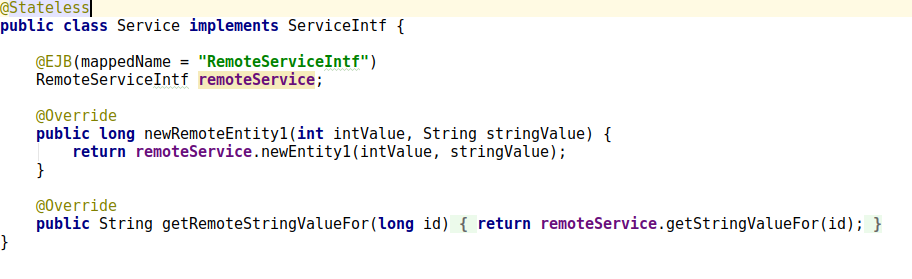
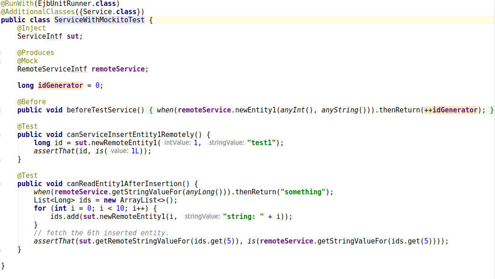

ejb-cdi-unit
============
Make test driven development of ejb-3.x services and processes easy.
Supports:

* JBoss7 and Wildfly 10
* Java 7 (until 1.1.12) Java8 and Java 10
* JUnit 4, JUnitRules
* JUnit 5 including nested classes, TestInstances(Testclasses) may only Inject
* Weld 1, 2, 3
* Processengine: Camunda 7.x


# Contents
<!-- TOC depthFrom:1 depthTo:6 withLinks:1 updateOnSave:1 orderedList:0 -->

- [Contents](#contents)
- [First Example](#first-example)
- [Motivation](#motivation)
- [History](#history)
- [Requirements](#requirements)
- [Solution](#solution)
- [Usage](#usage)
- [Maven-Modules](#maven-modules)
- [Java9+](#java9)
- [JUnit5](#junit5)
- [Examples](#examples)
	- [One Service and One Entity](#one-service-and-one-entity)
	- [One Service and One Synchronously Consumed Service](#one-service-and-one-synchronously-consumed-service)
	- [One Service and One Asynchronously Consumed Service](#one-service-and-one-asynchronously-consumed-service)
	- [One Service and One Asynchronously Consumed Service Plus Asynchronous Callback](#one-service-and-one-asynchronously-consumed-service-plus-asynchronous-callback)
	- [One Service and One Asynchronously Consumed Service internally using Messaging](#one-service-and-one-asynchronously-consumed-service-internally-using-messaging)
	- [Test of a Rest-Service](#test-of-a-rest-service)
	- [Test of a camunda BPM processing](#test-of-a-camunda-bpm-processing)
- [Restrictions](#restrictions)
- [Acknowledgments](#acknowledgments)
- [License](#license)

<!-- /TOC -->

# First Example

[sourcecode](https://github.com/1and1/ejb-cdi-unit/blob/master/examples/ex2-syncconsumed)


**Example Service to be tested**



**Test Exampleservice using ejb-cdi-unit and Mockito**



**Test Exampleservice using ejb-cdi-unit and Simulatorclass for consumed Service**


# Motivation
During the dvelopment of services, the necessity to implement automatic module-tests arises. In this context, a module means one deployable artifact.

Given the development occurs using an IDE (integrated development environment) like Eclipse or Intellij, the aim is to provide a module which makes it easy, to first write the test and then to develop the service. The standard approach to achieve this is to recreate a kind of server environment, including the destination server runtime, the destination datasources and message queues.
The effort to recreate these target runtime conditions on the development machine is often quite substantial. Sometimes it is even avoided and all testing is done using test servers or clients, often in a non automatic way.

ejb-cdi-unit is an extension of cdi-unit which contains modules/classes as they became necessary to support automatic tests of about 10 different service artifacts at our site. The about 2000 test functions in about 50000 lines of test code run without special requirements on the machine except java 8.x and maven. No dbms, messaging or other external server is necessary to run these tests. Some of this testcode is implemented in a way so that the main code can also be used in an arquillian-test-environment.

# History

1. In the beginning CDI-Alternatives where developed which helped to create a test environment.
1. As soon as multiple projects had to use the Alternatives they where extracted into a separate maven project and used from there.
1. Using the EjbExtension from cdi-unit some extensive changes have been made in the module to better simulate an ejb-test-environment.
1. CdiRunner was replaced by EjbUnitRunner to get rid of some initialitions and annotations which always were necessary.


# Requirements

What do we need to be able to achieve this?

* We need a kind of "test-enabled" ejb-container
    * Message queues must be simulated in memory (mockrunner)
    * @TransactionAttribute on EJBs must be handled in a correct way (at least not ignored)
    * @Startup-annotated Beans must be initialized so that other beans might refer to them indirectly.
    * You must be able to fill @Resource annotated fields by "something", which handles the calls in a feasable way.BusinessProcessScope
    * You must be able to handle or simulate arbitrary situations which are possible in an asynchronous working environment, as it is an ejb-server.
    * Sometimes it might be necessary to test using more than one thread. The test-container must be able to handle this as well.
    * The tests must be executable without much effort inside the IDE used for the test and application development.

# Solution

[*cdiunit*](http://jglue.org/cdi-unit/) helps very much by making it very easy

* to integrate the Weld SE
* to define the components (classes) of an project to be tested
* to define Alternatives to include mocks or simulators
* provided an extension which could be used to scan the classes and manipulate injections as it is necessary to build up a (automatic-) test environment

*ejbcdiunit* helps by extending the mentioned extensions so that ejb-specific injections are "doable" using cdi-technics. Additionally it provides helper classes which provide functionality that otherwise would have to be implemented in every test class or test project again.

* **PersistenceFactory** allows it, to use alternative (test) datasources in a easy way. There is a default which always searches a persistence-unit named "test".
* **SimulatedTransactionManager** handles per thread the stack of different transaction environmentsfixed
* **TransactionInterceptor** is used by the extension to encapsulate calls to ejbs
* **AsynchronousManager** is a singleton where asynchronously to be executed routines can be stored and later executed in a deterministic way.
* **AsynchronousInterceptor** encapsulate beans have method annotated @Asynchronous
* **SessionContextFactory** provides a SessionContextSimulation which will be injected where necessary.
* **TestPersistenceFactory** searches for persistence-unit "test", if it does not exist, using HibernatePersistenceProvider a configuration is created which can be used. Additionally, Entity-Classes will be discovered, if they are added via @AdditionalClasses, @AdditionalClassPath or @AdditionalPackage.


# Usage

The usage does not differ very much from cdi-unit:

* You need to include additionally:    

        <dependency>
            <groupId>net.oneandone</groupId>
            <artifactId>ejb-cdi-unit</artifactId>
            <version>${ejb-cdi-unit.version}</version>
            <scope>test</scope>
        </dependency>

* Instead @RunWith(CdiRunner) use @RunWith(EjbUnitRunner)
* It might be necessary to provide a specific persistence.xml using H2 and declaring the Entity-classes that are used during tests. When the name of the persistence-unit is test, the provided class TestPersistenceFactory can be used without further ado, to produce EntityManager-, Database- and UserTransaction-Objects.
* Some @Resource or @Ejb -injected objects might need Simulations either using Mockito or Helper classes in tests which are added as Alternatives or normal beans in @AdditionalClasses. Standard cdi-unit would leave those null.
* Services consumed by the Artifact might need Simulations. (same as cdi-unit)
* Rest-Services: Good experiences have been made in using the RestEasy MockDispatcherFactory.  (same as cdi-unit)

# Maven-Modules

* ejb-cdi-unit is the module providing the test extensions, it is available from maven central
* ejb-cdi-unit5 is the module providing the test extensions for JUnit5, it is available from maven central
* ejb-cdi-unit-test-war is code used by
	* ejb-cdi-unit-tests in regression tests
	* ejb-cdi-unit-tests5 regression tests using JUnit5
	* ejb-cdi-unit-tomee to show how the tests can be implemented using tomee embedded
	* ejb-cdi-unit-arq to prove that the modules behaviour fits to wildfly
* ejb-cdi-unit-tomee-simple contains some code doing simple tests only with tomee. ejb-cdi-unit is not used here.
* ejb-cdi-unit-camunda contains the camunda-bpm-platform/engine-cdi - tests ported from arquillian to ejb-cdi-unit.
* examples contains showcases including some diagrams which should show the usage together with the internal working of ejb-cdi-unit. Some proposed solutions for easy simulation of remote Services and callbacks are also shown there.

# Java9+
<a name="java9"></a>

At the moment, there is no ejb-application-server that supports modules. Therefore the scan for CDI-Classes only uses the classpath. To support Java9+ the reflections-dependency has been rewritten to use Java8-features and to get rid of guava (because of possible compatibility-issues with the code under test) The new artifact is named net.oneandone:reflections8. 

# JUnit5

## Concept
**1.1.16**
The Root-Testclasses are created in ApplicationScoped together with the CDI-Container. So they behave like normal CDI-Beans. nested Innerclasses not since they are non static. The JUnit-Lifecycle can be used to control if a new Container is created every test or not.


**Before 1.1.15 and 1.1.15.2:**

As realized in the JUnit4 implementation, the Testclass "lives" inside the CDI-Container as applicationscoped bean. 
This works, because the Runner can create the actual instance of the testclass. This does not work anymore in the case you want to support
JUnitRules or JUnit5. Then the actual testclass is created by the framework, that does not use the CDI-Container to handle the instances.

The solution of ejb-cdi-unit is:

*Restrict the testclasses to support only @Inject*. 
Handling @Inject allows the full integration of the tests inside the CDI-Container. All beans to be tested can be injected and used
inside the test-methods.
 
The restrictions normally are not so imposing. 
* PostConstruct, PreDestroy will not work
* Interceptors will not work. 
* Decorators will not work
* Producers may not use not injected Instance-variables
but normally this is not important for the testclasses.

Technically the TestInstances are fetched as they are created by JUnit5 and the injected instance-variables are initialized
by copying them from another Instance of the test-class which is created during the initialization of the CDI-Container.

## Usage


**pom properties**
```XML
<properties>
	<ejb-cdi-unit.version>1.1.16</ejb-cdi-unit.version>
        <weld-se.version>2.3.5.Final</weld-se.version>
        <junit5.version>5.3.0</junit5.version>
        <surefire.version>2.22.0</surefire.version>
        <junit-platform.version>1.3.0</junit-platform.version>
</properties>
```
**dependencies**
```XML
 <dependency>
	<groupId>net.oneandone</groupId>
	<artifactId>ejb-cdi-unit5</artifactId>
	<version>${ejb-cdi-unit.version}</version>
	<scope>test</scope>
</dependency>
<dependency>
	<groupId>org.jboss.weld.se</groupId>
	<artifactId>weld-se-core</artifactId>
	<version>${weld-se.version}</version>
	<scope>test</scope>
</dependency>
```
**New surefire plugin**
```XML
<plugin>
	<groupId>org.apache.maven.plugins</groupId>
	<artifactId>maven-surefire-plugin</artifactId>
	<version>${surefire.version}</version>
	<dependencies>
		<dependency>
			<groupId>org.junit.platform</groupId>
			<artifactId>junit-platform-surefire-provider</artifactId>
			<version>${junit-platform.version}</version>
		</dependency>
		<dependency>
			<groupId>org.junit.jupiter</groupId>
			<artifactId>junit-jupiter-engine</artifactId>
			<version>${junit5.version}</version>
		</dependency>
	</dependencies>
</plugin>
```

* Annotate the JUnit5-Testclass with @ExtendWith(JUnit5Extension)
Examples: see: [tests](https://github.com/1and1/ejb-cdi-unit/tree/master/ejb-cdi-unit-tests5) and [ex1-1entity5](https://github.com/1and1/ejb-cdi-unit/tree/master/examples/ex1-1entity5)

# Examples

Several examples which should demonstrate how different kinds of artifacts can be tested using ejb-cdi-unit.

## One Service and One Entity
This example contains a Service implemented as stateless EJB which can return a constant number and offers the possibility to
add an Entity to a database and to search for it by its id.

[see](https://github.com/1and1/ejb-cdi-unit/tree/master/examples/ex1-1entity)


## One Service and One Synchronously Consumed Service

This simple kind of service just provides a service-interface does some calculations and  synchronously consumes some interfaces from other services it uses. A suggestion how such a service can be tested using ejb-cdi-unit will be shown

 [see](https://github.com/1and1/ejb-cdi-unit/blob/master/examples/ex2-syncconsumed)


## One Service and One Asynchronously Consumed Service
The handling of @Asynchronous is demonstrated in the following examples.

[see](https://github.com/1and1/ejb-cdi-unit/tree/master/examples/ex3-asyncconsumedpoll)

## One Service and One Asynchronously Consumed Service Plus Asynchronous Callback

The previous example gets extended in a way so that the original service consumes a special interface its client provides and calls back as soon as the answer is ready.

[see](https://github.com/1and1/ejb-cdi-unit/tree/master/examples/ex4-asyncconsumedpush)


## One Service and One Asynchronously Consumed Service internally using Messaging

To provide a safe handling of service calls often message driven beans are used.
In this way it can be made sure that requests are not lost even if a process or thread dies. Additionally in this way other cluster nodes can pick up in the processing.

Using two separate queues:

[see](https://github.com/1and1/ejb-cdi-unit/tree/master/examples/ex5-asyncconsumedjms1)

Using one queue, mdbs are triggered by a defined messageSelector.

[see](https://github.com/1and1/ejb-cdi-unit/tree/master/examples/ex6-asyncconsumedjms2)

## Test of a Rest-Service

This example shows how it is easily possible to test a artifact by it's rest-interface and being able to use the database at the same time.

[see](https://github.com/1and1/ejb-cdi-unit/tree/master/examples/ex7-simplerest)

## Test of a camunda BPM processing

To support testing of processes ejb-cdi-unit contains CdiProcessEngineTestCase. Tests derived from that class can start processes, use/change Variables ... .
The test of camunda-bpm-platform/engine-cdi are ported to [ejb-cdi-unit-camunda](https://github.com/1and1/ejb-cdi-unit/tree/master/ejb-cdi-unit-camunda/src/test/java/org/camunda/bpm/engine/cdi/cdiunittest).

# Restrictions
The helpers have been developed as required, therefore it was not necessarily a  goal to fully adhere to the J2EE-standard:

* **Transactions** are simulated for JPA adhering to  TransactionAttributes-Annotations of methods and classes. The TransactionManager handling this:
	* does not handle distributed Transactions
	* the attributes are only supported for JPA-Objects (EntityManager), JDBC is not included.
	* JMS-Objects are not included.
	* Allows it to use UserTransactions everywhere. This is reasonable in test-code, but mostly not allowed in the module-code.
* **JMS-Simulation**
  * works in memory
 	* Name matching between objects (topics, queue) and Mdb is done using the last part of the names.
	* Does not react to rollbacks of the TransactionManager-Simulation.
* **SessionContextSimulation** was mainly developed to support the getBusinessObject-Method and to return something reasonable when asked for a principal.
* **TimerServiceSimulation, MessageContextSimulation, SimulatedUserTransaction, WebServiceContextSimulation** provide mocks which will be injected as resources, but do not provide much functionality.


# Acknowledgments

* The base and idea for this module comes from [cdiunit](https://github.com/BrynCooke/cdi-unit). Some of the code has been shamelessly copied from there.
* [mockrunner](http://mockrunner.github.io/) is used for all jms-simulations.
* [weld](http://weld.cdi-spec.org/) is the cdi-container used for the tests as it is also determined because of the usage of cdi-unit. Since on our site jboss7  is yet in use, compatibility to 1.1.14 is required throughout.
* [camunda](https://github.com/camunda/camunda-bpm-platform) the github-project supporting camunda-bpm-platform.


# License

Copyright 2017 1&amp;1 Internet AG, https://github.com/1and1/ejb-cdi-unit

   Licensed under the Apache License, Version 2.0 (the "License");
   you may not use this file except in compliance with the License.
   You may obtain a copy of the License at

       http://www.apache.org/licenses/LICENSE-2.0

   Unless required by applicable law or agreed to in writing, software
   distributed under the License is distributed on an "AS IS" BASIS,
   WITHOUT WARRANTIES OR CONDITIONS OF ANY KIND, either express or implied.
   See the License for the specific language governing permissions and
   limitations under the License.
