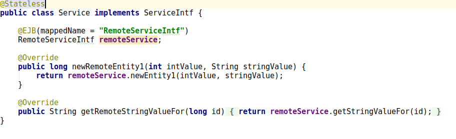
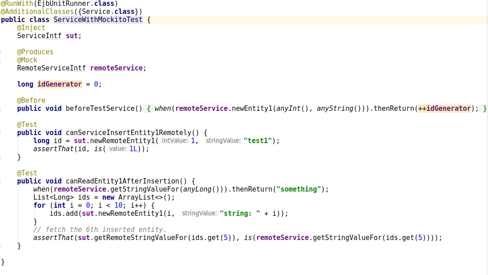
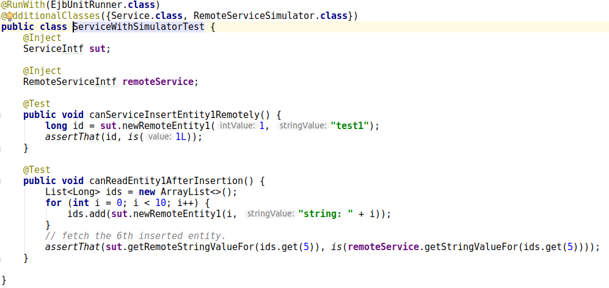

ioc-unit (formerly ejb-cdi-unit)
================================


# Where can ioc-unit-ejb help..

## My Testcode needs 
* To be developed and started directly in my IDE (intellij, eclipse, netbeans)
* A real DBMS (even if probably simulated in memory) executing real Statements generated or provided by Productive and Testcode
* To test situations where multiple Transactionattributes like SUPPORTS, NOT_SUPPORTED, REQUIRED and REQUIRES_NEW have to be kept in mind. 
* an Entitymanager in my Testcode to work with the entities defined in the productiv code.
* to test the flow of jms-messages throw an arbitrary number of Messagedriven beans in a deterministic manner.
* to use multiple threads to simulate productive situations and handle database connection and transactions correctly.  
* To avoid server-deployment during the development cycle, to speed up the check/test of the newly developed code, as required in TDD. 
* to start a testdbms (H2) in an easy way without having to fumble with extra persistence-units in test-persistence.xml-files 

# Where can ioc-unit-resteasy help
## My Testcode needs 
* to check if the code, as it works from the incoming HTTP(S)-Call to the applicationcode, does the right conversions, filters, mappings...
* to check resteasy resources
* to check jax-rs resources even if the productive environment does not use resteasy, the standard can be tested.
* to work with ExceptionMappers, ObjectMappers, everything annotated by @Provider
* not if you want to check the authentication and authorization support.

Use this module **standalone** (without `ioc-unit-validate`) whenever the test is purely about the
REST/JAX-RS layer: resource dispatch, marshalling/unmarshalling, providers, exception mapping,
authorization. Note: `resteasy-validator-provider` (pulled in automatically, see below) only wires
RESTEasy's own `@Valid` request/response interceptor — it does **not** by itself produce a CDI
`jakarta.validation.ValidatorFactory` bean. If your test needs real Bean Validation constraint
violations enforced (not just RESTEasy's interceptor plumbing), add `ioc-unit-validate` as well.

# Where can ioc-unit-validate help
## My Testcode needs
* real `jakarta.validation` (Bean Validation) constraints (`@NotNull`, `@Size`, custom
  constraints, ...) to actually be enforced on CDI bean method parameters/return values or on
  injected objects, throwing `ConstraintViolationException` like a real container would.
* a real, injectable `jakarta.validation.ValidatorFactory`/`Validator`, without any REST/JAX-RS
  layer involved.

Use this module **standalone** (without `ioc-unit-resteasy`) for plain CDI/service-level tests
that validate objects or method arguments directly — no HTTP dispatch needed. Combine it with
`ioc-unit-resteasy` only when a test needs to verify that invalid REST request bodies actually
trigger Bean Validation end-to-end through a JAX-RS resource.

# Where can ioc-unit help
## My Testcode needs to
* Inject Testalternatives in an easy way, without having to do big configurations in extra beans.xml 
* define easily and deterministicly which parts of the system under test should be started or should be replaced by mocks.
* get hints during the starting of the testcontainer, what parts should be added to the testconfiguration, and where there might be problems.


# Where can ioc-unit-mockseasy help
## My Testcode
* needs more than @InjectMocks provides, to replace @Injects in productiv-code by Mockito or Easymock-Mocks.

# What should this project achieve

Support the development of tests inside non-trivial CDI/EJB-service-modules containing several hundred classes, entities, transactions, queues without starting the destination environment.

Current environments either are full fledged integration tests which create the deployment structures and deploy those inside arquillian together with some testclasses. The problem here often is, that the server start is complicated to configure inside a developmentenvironment and the tests sometimes are not easily developed in a deterministic manor(because of multithreading, timers, asynchronous,...).

The other possibility is to take a few classes to be tested out of the service and mock everything else using frameworks like mockito. The problem here can be, that the tests know very much about the internal structure of the services which makes refactoring often not so easy as agile development demands it.

Then there is a way in between, which starts parts of the service inside a lightweight CDI-Environment (weld-se), mocks serviceinterfaces which are consumed and simulates responses or callbacks from outside. In this category weld-junit, cdi-unit, ejb-cdi-unit can be found. This works quite well with simple services, but makes the creation of automatic tests which possibly need hundreds of classes to run, quite difficult. 

ioc-Unit also falls into that category but:

* it helps to easily define the set of classes necessary to be included into the testconfiguration
* it supports some extensions to the standalone environment which help to simulate databases, queues, asynchronous situations, requestcontexts. 


# Currently 

In this branch there is no ejb-cdi-unit anymore.
The past showed that it is sometimes quite cumbersome to create a new test for an existing module. The causes for that 
lie in the, most of the time helpful, intelligence of CDI-Unit in adding classes to the test-configuration.
There is more about that in ....

Therefore a module has been developed that 
* discrimates between Test-Classes and "System under Test" Sut-Classes. This is done using new Annotations which are similar 
in their function to the CDI-Unit-Annotations 
* analyzes the injection points during adding of Classes to the system-configuration. 
* finds according to so called available classes the best fitting candidate as producer for the injections.

# Concepts


## Defined, Available and Excluded classes

**Defined classes** are: 
* The Testclass
* Classes added by Annotations @TestClasses, @SutClasses

They will be added to the configuration to be started when weld starts in any event.

**Available classes** are:
* Classes added by Annotations @TestPackages, @SutPackages, @TestPackagesDeep, @SutPackagesDeep, @TestClasspaths, @SutClasspaths
* Static inner classes found when adding Defined Classes to the set of available classes.

They will be added to the configuration
   * if an instance of themselves can be used as inject
   * if they provide a producer that can be used as inject
   * only if ambiguity heuristics decide their priority against other classes
   
**Excluded classes** are:
* Classes added by the annotations @ExcludedClasses
Every time a class is selected as candidate and @ExcludedClasses has been encountered before, this candidate is not used for resolution. If @ExcludedClasses gets encountered for a class already selected it has no effect for that class.

## Candidates

**Available Candidates** are:
* no defined class
* previously available classes
* the classes themselves or a producer contained matches an inject
* has been chosen amongst probably multiple candidates to match the inject. The competing classes are 
rejected candidates.
* might be a testclass and as such might be annotated by configuring annotations.

**Rejected Candidates** are:
* no defined classes
* currently availabe classes but might lead to ambiguity concerning one certain inject
* the classes themselves or a producer contained matches an inject


## Test-Sut

**Testclasses** are
* The Testclass itself
* All classes added using @TestClasses, @TestPackages, @TestPackagesDeep, @TestClasspaths
* Static inner classes of Testclasses, if these are not denoted otherwise as Sutclasses
* Can hold Configuring Annotations 

**Sutclasses** are
* All classes added using @SutClasses, @SutPackages, @SutPackagesDeep, @SutClasspaths
* May not hold Configuring Annotations. If a Sutclass does, a Warning is produced.

In case of ambiguities, Testclasses and Producers in Testclasses get priority over Sutclasses and their producers.

## Alternatives

If something is defined as Alternative according to the CDI-Spec and enabled according CDI-Spec. They get priority over 
other productions usable for injects. Alternative-Stereotypes must be added to the configuration
using @SutClasses or @TestClasses. @ProducesAlternative is defined by default. Alternative-Classes can be added using 
@EnabledAlternatives.

## Configuring Annotations
By using Annotations at the Testclass itself or other classes denoted as Testclasses the configuration information
provided to Weld-Se is defined.
These Annotations are _@TestClasses, @SutClasses, @TestPackages, @SutPackages, @TestPackagesDeep, @SutPackagesDeep, 
@TestClasspaths, @SutClasspaths, 
@EnablesAlternatives, @ExcludedClasses_ 
Since the building process works in several levels during which "available" classes might be added which themselves 
might be annotated by configuring annotations, annotations encountered in a later level might contradict decisions made 
earlier. 
* An enabled Alternative might have already been excluded as candidate for an inject
* An inner class denoted as testclass or sutclass because of the containing class, might be changed at a later level by
a configuring annotation. This will lead to an error if this class already has been used to satisfy an inject in an 
earlier level.                       
                 


## ConfigCreator
The algorithm trying to create a configuration for the standalone engine works in several levels

Initially: the testclass, all defined classes and some initial classes defined by the -tester-jars are input to the 
first level.

Each level the builder handles contains 4 phases:
* **Analyzing and Collecting** Phase: Input classes are analyzed collections of injects and producers are built up.   
   * configuring annotations of testclasses are interpreted. new defined classes are added to the level and 
analyzed during this level as well.  
   * the classes are searched for producers
   * the classes are searched for injects (fields, constructors and injects)
   * the classes are searched for static inner classes. these are added as "available" classes.
* **Matching** Phase Found injects
   * all encountered injects will be matched with producers and defined classes
   * if an inject matches, it is denoted as handled
   * if there are more than one matches for one inject and one of it originates from a Testclass.
      * exclude the Sut-Classes comprising the other match. 
      * Write warning. 
      * This might lead to dangling other injects! It is an easy decision if the inject is the only match, otherwise search for
        injects.
* **Fixing** Phase builds probably up new input for the next level  
   * injects not yet matched are tried to be matched using available testclasses and their contained producers
   * injects not yet matched are tried to be matched using available sutclasses and their contained producers
   * classes found during the extensionphase are new input to the next level. If more than one classes is found 
   then the priority is:
      * enabled Alternatives
      * testclasses
      * sutclasses   
* **Guessing** if there are injects to matched, but the Fixing-Phase has not produced any new candidates this phase is started.
It works similar to cdi-unit.
All injects not yet matched are handled if they
   * are allowed to be beans according to CDI-Spec: They are added as candidates for the next analyzing and collecting phase
   * cannot be beans because they are abstract or interfaces: This leads to adding the class as if @SutClasspath or @TestClasspath 
        was found. 
The decision if the guessed classes are Sut or Test is made by looking at their classpath. If the classpath is already 
found as testclasspath, the added candidates are handled as tests, otherwise as sut.


Make test driven development of ejb-3.x services and processes easy.
Supports:

* JBoss7 and Wildfly 10
* Java 7 (until 1.1.12) Java8 and Java 10
* JUnit 4, JUnitRules
* JUnit 5 including nested classes, TestInstances(Testclasses) may only Inject
* Weld 1, 2, 3
* Processengine: Camunda 7.x


# Contents
<!-- TOC depthFrom:1 depthTo:6 withLinks:1 updateOnSave:1 orderedList:0 -->

- [Contents](#contents)
- [First Example](#first-example)
- [Motivation](#motivation)
- [History](#history)
- [Requirements](#requirements)
- [Solution](#solution)
- [Usage](#usage)
- [Maven-Modules](#maven-modules)
- [Java9+](#java9)
- [JUnit5](#junit5)
- [Examples](#examples)
	- [One Service and One Entity](#one-service-and-one-entity)
	- [One Service and One Synchronously Consumed Service](#one-service-and-one-synchronously-consumed-service)
	- [One Service and One Asynchronously Consumed Service](#one-service-and-one-asynchronously-consumed-service)
	- [One Service and One Asynchronously Consumed Service Plus Asynchronous Callback](#one-service-and-one-asynchronously-consumed-service-plus-asynchronous-callback)
	- [One Service and One Asynchronously Consumed Service internally using Messaging](#one-service-and-one-asynchronously-consumed-service-internally-using-messaging)
	- [Test of a Rest-Service](#test-of-a-rest-service)
	- [Test of a camunda BPM processing](#test-of-a-camunda-bpm-processing)
- [Restrictions](#restrictions)
- [Acknowledgments](#acknowledgments)
- [License](#license)

<!-- /TOC -->

# First Example

[sourcecode](https://github.com/1and1/ioc-unit/blob/master/examples/ex2-syncconsumed)


**Example Service to be tested**



**Test Exampleservice using ejb-cdi-unit and Mockito**



**Test Exampleservice using ejb-cdi-unit and Simulatorclass for consumed Service**




# Motivation
During the dvelopment of services, the necessity to implement automatic module-tests arises. In this context, a module means one deployable artifact.

Given the development occurs using an IDE (integrated development environment) like Eclipse or Intellij, the aim is to provide a module which makes it easy, to first write the test and then to develop the service. The standard approach to achieve this is to recreate a kind of server environment, including the destination server runtime, the destination datasources and message queues.
The effort to recreate these target runtime conditions on the development machine is often quite substantial. Sometimes it is even avoided and all testing is done using test servers or clients, often in a non automatic way.

ejb-cdi-unit is an extension of cdi-unit which contains modules/classes as they became necessary to support automatic tests of about 10 different service artifacts at our site. The about 2000 test functions in about 50000 lines of test code run without special requirements on the machine except java 8.x and maven. No dbms, messaging or other external server is necessary to run these tests. Some of this testcode is implemented in a way so that the main code can also be used in an arquillian-test-environment.

# History

1. In the beginning CDI-Alternatives where developed which helped to create a test environment.
1. As soon as multiple projects had to use the Alternatives they where extracted into a separate maven project and used from there.
1. Using the EjbExtension from cdi-unit some extensive changes have been made in the module to better simulate an ejb-test-environment.
1. CdiRunner was replaced by EjbUnitRunner to get rid of some initialitions and annotations which always were necessary.


# Requirements

What do we need to be able to achieve this?

* We need a kind of "test-enabled" ejb-container
    * Message queues must be simulated in memory (mockrunner)
    * @TransactionAttribute on EJBs must be handled in a correct way (at least not ignored)
    * @Startup-annotated Beans must be initialized so that other beans might refer to them indirectly.
    * You must be able to fill @Resource annotated fields by "something", which handles the calls in a feasable way.BusinessProcessScope
    * You must be able to handle or simulate arbitrary situations which are possible in an asynchronous working environment, as it is an ejb-server.
    * Sometimes it might be necessary to test using more than one thread. The test-container must be able to handle this as well.
    * The tests must be executable without much effort inside the IDE used for the test and application development.

# Solution

[*cdiunit*](http://jglue.org/cdi-unit/) helps very much by making it very easy

* to integrate the Weld SE
* to define the components (classes) of an project to be tested
* to define Alternatives to include mocks or simulators
* provided an extension which could be used to scan the classes and manipulate injections as it is necessary to build up a (automatic-) test environment

*ejbcdiunit* helps by extending the mentioned extensions so that ejb-specific injections are "doable" using cdi-technics. Additionally it provides helper classes which provide functionality that otherwise would have to be implemented in every test class or test project again.

* **PersistenceFactory** allows it, to use alternative (test) datasources in a easy way. There is a default which always searches a persistence-unit named "test".
* **SimulatedTransactionManager** handles per thread the stack of different transaction environmentsfixed
* **TransactionInterceptor** is used by the extension to encapsulate calls to ejbs
* **AsynchronousManager** is a singleton where asynchronously to be executed routines can be stored and later executed in a deterministic way.
* **AsynchronousInterceptor** encapsulate beans have method annotated @Asynchronous
* **SessionContextFactory** provides a SessionContextSimulation which will be injected where necessary.
* **TestPersistenceFactory** searches for persistence-unit "test", if it does not exist, using HibernatePersistenceProvider a configuration is created which can be used. Additionally, Entity-Classes will be discovered, if they are added via @AdditionalClasses, @AdditionalClassPath or @AdditionalPackage.


# Usage

## Dependency management (BOM-first)

ioc-unit is meant to be used inside a project that is already built against a WildFly
version. Most Jakarta EE APIs, Hibernate, and container-internal artifacts it compiles against
are declared with `<scope>provided</scope>` and are **not** pinned by ioc-unit — your
application's own WildFly BOM imports are what actually decide which versions end up on the test
classpath, so there is no duplicate/conflicting version of these libraries shipped transitively by
ioc-unit itself.

A smaller set of dependencies, however, are things a real WildFly container would normally supply
but that a *standalone* Weld SE test JVM (as bootstrapped by `weld4-starter`) has nothing else to
supply. For exactly these, the owning module declares them at `compile` scope instead, so they
flow to you automatically without any extra declaration on your side:

* `weld4-starter`: `weld-spi`, `weld-api`, `jakarta.el:jakarta.el-api`, `org.glassfish:jakarta.el`
  (the EL implementation is required because `weld-web`, which `weld4-starter` also declares,
  eagerly touches `jakarta.el.ExpressionFactory` during Weld container startup — it lives here,
  not in `ioc-unit-validate`, so it flows to *every* IocUnit test, whether or not `ioc-unit-validate`
  is used).
* `ioc-unit-validate`: `hibernate-validator`, `hibernate-validator-cdi`.
* `ioc-unit-resteasy`: `resteasy-core`, `resteasy-client`, `resteasy-jackson2-provider`, `resteasy-validator-provider`, `rest-assured`, `reactive-streams`, `json-patch`.

See each module's own README for the full picture of what it needs, and what (if anything) is
still your own project's responsibility to add (e.g. your JPA provider for `ioc-unit-ejb`, or
your mocking library of choice for `ioc-unit-mockseasy`).

Import both BOMs in your project's `dependencyManagement` (order matters: your WildFly
BOMs first, then the ioc-unit BOM):

```XML
<dependencyManagement>
    <dependencies>
        <!-- Pins every Jakarta EE / Hibernate / RESTEasy / etc. version to match a real
             WildFly 39 runtime. -->
        <dependency>
            <groupId>org.wildfly.bom</groupId>
            <artifactId>wildfly-ee-with-tools</artifactId>
            <version>39.0.1.Final</version>
            <type>pom</type>
            <scope>import</scope>
        </dependency>
        <dependency>
            <groupId>org.wildfly.bom</groupId>
            <artifactId>wildfly-expansion-with-tools</artifactId>
            <version>39.0.1.Final</version>
            <type>pom</type>
            <scope>import</scope>
        </dependency>

        <!-- Pins every net.oneandone.ioc-unit:* artifact to one consistent version. -->
        <dependency>
            <groupId>net.oneandone.ioc-unit</groupId>
            <artifactId>ioc-unit-bom</artifactId>
            <version>${ioc-unit.version}</version>
            <type>pom</type>
            <scope>import</scope>
        </dependency>
    </dependencies>
</dependencyManagement>
```

Then declare the modules you need, without repeating a version (it comes from the BOM
above), and normally scoped `test`:

```XML
<dependency>
    <groupId>net.oneandone.ioc-unit</groupId>
    <artifactId>ioc-unit</artifactId>
    <scope>test</scope>
</dependency>
```

Notes:
* Weld (`org.jboss.weld:*`) is **not** part of the WildFly BOM (it is a container-internal
  detail), so ioc-unit still pins its own Weld version internally. This only affects
  ioc-unit's own build/test classpath, not yours.
* `jakarta.el` is intentionally still pinned and supplied at `compile` scope by
  `weld4-starter` (not `ioc-unit-validate` — see above) rather than taken from the WildFly BOM,
  since WildFly manages EL under a different artifact
  (`org.jboss.spec.jakarta.el:jboss-el-api_5.0_spec`) than the `jakarta.el:jakarta.el-api` /
  `org.glassfish:jakarta.el` GAs used here — and a standalone Weld SE test JVM has no WildFly
  container to supply either one anyway. Every IocUnit test depends on `weld4-starter`, so this
  is available regardless of which other ioc-unit modules (e.g. `ioc-unit-validate`,
  `ioc-unit-resteasy`) you do or don't include.
* Requires Java 17+ and Maven 3.8+ (enforced by the reactor's `maven-enforcer-plugin`).

The usage does not differ very much from cdi-unit:


* You need to include additionally:    

        <dependency>
            <groupId>net.oneandone.ioc-unit</groupId>
            <artifactId>ioc-unit</artifactId>
            <version>${ioc-unit.version}</version>
            <scope>test</scope>
        </dependency>

* Instead @RunWith(CdiRunner) use @RunWith(EjbUnitRunner)
* It might be necessary to provide a specific persistence.xml using H2 and declaring the Entity-classes that are used during tests. When the name of the persistence-unit is test, the provided class TestPersistenceFactory can be used without further ado, to produce EntityManager-, Database- and UserTransaction-Objects.
* Some @Resource or @Ejb -injected objects might need Simulations either using Mockito or Helper classes in tests which are added as Alternatives or normal beans in @AdditionalClasses. Standard cdi-unit would leave those null.
* Services consumed by the Artifact might need Simulations. (same as cdi-unit)
* Rest-Services: Good experiences have been made in using the RestEasy MockDispatcherFactory.  (same as cdi-unit)

# Maven-Modules

* ejb-cdi-unit is the module providing the test extensions, it is available from maven central
* ejb-cdi-unit5 is the module providing the test extensions for JUnit5, it is available from maven central
* ioc-unit-test-war is code used by
	* ioc-unit-tests in regression tests
	* ioc-unit-tests5 regression tests using JUnit5
	* ejb-cdi-unit-tomee to show how the tests can be implemented using tomee embedded
	* ejb-cdi-unit-arq to prove that the modules behaviour fits to wildfly
* ejb-cdi-unit-tomee-simple contains some code doing simple tests only with tomee. ejb-cdi-unit is not used here.
* ejb-cdi-unit-camunda contains the camunda-bpm-platform/engine-cdi - tests ported from arquillian to ejb-cdi-unit.
* examples contains showcases including some diagrams which should show the usage together with the internal working of ejb-cdi-unit. Some proposed solutions for easy simulation of remote Services and callbacks are also shown there.

# Java9+
<a name="java9"></a>

At the moment, there is no ejb-application-server that supports modules. Therefore the scan for CDI-Classes only uses the classpath. To support Java9+ the reflections-dependency has been rewritten to use Java8-features and to get rid of guava (because of possible compatibility-issues with the code under test) The new artifact is named net.oneandone:reflections8. 

# JUnit5

## Concept
**1.1.16**
The Root-Testclasses are created in ApplicationScoped together with the CDI-Container. So they behave like normal CDI-Beans. nested Innerclasses not since they are non static. The JUnit-Lifecycle can be used to control if a new Container is created every test or not.


**Before 1.1.15 and 1.1.15.2:**

As realized in the JUnit4 implementation, the Testclass "lives" inside the CDI-Container as applicationscoped bean. 
This works, because the Runner can create the actual instance of the testclass. This does not work anymore in the case you want to support
JUnitRules or JUnit5. Then the actual testclass is created by the framework, that does not use the CDI-Container to handle the instances.

The solution of ejb-cdi-unit is:

*Restrict the testclasses to support only @Inject*. 
Handling @Inject allows the full integration of the tests inside the CDI-Container. All beans to be tested can be injected and used
inside the test-methods.
 
The restrictions normally are not so imposing. 
* PostConstruct, PreDestroy will not work
* Interceptors will not work. 
* Decorators will not work
* Producers may not use not injected Instance-variables
but normally this is not important for the testclasses.

Technically the TestInstances are fetched as they are created by JUnit5 and the injected instance-variables are initialized
by copying them from another Instance of the test-class which is created during the initialization of the CDI-Container.

## Usage


**pom properties**
```XML
<properties>
	<ejb-cdi-unit.version>1.1.16</ejb-cdi-unit.version>
        <weld-se.version>2.3.5.Final</weld-se.version>
        <junit5.version>5.3.0</junit5.version>
        <surefire.version>${maven-surefire-plugin.version}</surefire.version>
        <junit-platform.version>1.3.0</junit-platform.version>
</properties>
```
**dependencies**
```XML
 <dependency>
	<groupId>net.oneandone</groupId>
	<artifactId>ejb-cdi-unit5</artifactId>
	<version>${ejb-cdi-unit.version}</version>
	<scope>test</scope>
</dependency>
<dependency>
	<groupId>org.jboss.weld.se</groupId>
	<artifactId>weld-se-core</artifactId>
	<version>${weld-se.version}</version>
	<scope>test</scope>
</dependency>
```
**New surefire plugin**
```XML
<plugin>
	<groupId>org.apache.maven.plugins</groupId>
	<artifactId>maven-surefire-plugin</artifactId>
	<version>${surefire.version}</version>
	<dependencies>
		<dependency>
			<groupId>org.junit.platform</groupId>
			<artifactId>junit-platform-surefire-provider</artifactId>
			<version>${junit-platform.version}</version>
		</dependency>
		<dependency>
			<groupId>org.junit.jupiter</groupId>
			<artifactId>junit-jupiter-engine</artifactId>
			<version>${junit5.version}</version>
		</dependency>
	</dependencies>
</plugin>
```

* Annotate the JUnit5-Testclass with @ExtendWith(JUnit5Extension)
Examples: see: [tests](https://github.com/1and1/ioc-unit/tree/master/ioc-unit-tests5) and [ex1-1entity5](https://github.com/1and1/ioc-unit/tree/master/examples/ex1-1entity5)

# Examples

Several examples which should demonstrate how different kinds of artifacts can be tested using ejb-cdi-unit.

## One Service and One Entity
This example contains a Service implemented as stateless EJB which can return a constant number and offers the possibility to
add an Entity to a database and to search for it by its id.

[see](https://github.com/1and1/ioc-unit/tree/master/examples/ex1-1entity)


## One Service and One Synchronously Consumed Service

This simple kind of service just provides a service-interface does some calculations and  synchronously consumes some interfaces from other services it uses. A suggestion how such a service can be tested using ioc-unit will be shown

 [see](https://github.com/1and1/ioc-unit/blob/master/examples/ex2-syncconsumed)


## One Service and One Asynchronously Consumed Service
The handling of @Asynchronous is demonstrated in the following examples.

[see](https://github.com/1and1/ioc-unit/tree/master/examples/ex3-asyncconsumedpoll)

## One Service and One Asynchronously Consumed Service Plus Asynchronous Callback

The previous example gets extended in a way so that the original service consumes a special interface its client provides and calls back as soon as the answer is ready.

[see](https://github.com/1and1/ioc-unit/tree/master/examples/ex4-asyncconsumedpush)


## One Service and One Asynchronously Consumed Service internally using Messaging

To provide a safe handling of service calls often message driven beans are used.
In this way it can be made sure that requests are not lost even if a process or thread dies. Additionally in this way other cluster nodes can pick up in the processing.

Using two separate queues:

[see](https://github.com/1and1/ioc-unit/tree/master/examples/ex5-asyncconsumedjms1)

Using one queue, mdbs are triggered by a defined messageSelector.

[see](https://github.com/1and1/ioc-unit/tree/master/examples/ex6-asyncconsumedjms2)

## Test of a Rest-Service

This example shows how it is easily possible to test a artifact by it's rest-interface and being able to use the database at the same time.

[see](https://github.com/1and1/ioc-unit/tree/master/examples/ex7-simplerest)

## Test of a camunda BPM processing

To support testing of processes ioc-unit contains CdiProcessEngineTestCase. Tests derived from that class can start processes, use/change Variables ... .
The test of camunda-bpm-platform/engine-cdi are ported to [ioc-unit-camunda](https://github.com/1and1/ioc-unit/tree/master/ioc-unit-camunda/src/test/java/org/camunda/bpm/engine/cdi/cdiunittest).

# Restrictions
The helpers have been developed as required, therefore it was not necessarily a  goal to fully adhere to the J2EE-standard:

* **Transactions** are simulated for JPA adhering to  TransactionAttributes-Annotations of methods and classes. The TransactionManager handling this:
	* does not handle distributed Transactions
	* the attributes are only supported for JPA-Objects (EntityManager), JDBC is not included.
	* JMS-Objects are not included.
	* Allows it to use UserTransactions everywhere. This is reasonable in test-code, but mostly not allowed in the module-code.
* **JMS-Simulation**
  * works in memory
 	* Name matching between objects (topics, queue) and Mdb is done using the last part of the names.
	* Does not react to rollbacks of the TransactionManager-Simulation.
* **SessionContextSimulation** was mainly developed to support the getBusinessObject-Method and to return something reasonable when asked for a principal.
* **TimerServiceSimulation, MessageContextSimulation, SimulatedUserTransaction, WebServiceContextSimulation** provide mocks which will be injected as resources, but do not provide much functionality.


# Acknowledgments

* The base and idea for this module comes from [cdiunit](https://github.com/BrynCooke/cdi-unit). Some of the code has been shamelessly copied from there.
* [mockrunner](http://mockrunner.github.io/) is used for all jms-simulations.
* [weld](http://weld.cdi-spec.org/) is the cdi-container used for the tests as it is also determined because of the usage of cdi-unit. Since on our site jboss7  is yet in use, compatibility to 1.1.14 is required throughout.
* [camunda](https://github.com/camunda/camunda-bpm-platform) the github-project supporting camunda-bpm-platform.


# License

Copyright 2017 1&amp;1 Internet AG, https://github.com/1and1/ioc-unit

   Licensed under the Apache License, Version 2.0 (the "License");
   you may not use this file except in compliance with the License.
   You may obtain a copy of the License at

       http://www.apache.org/licenses/LICENSE-2.0

   Unless required by applicable law or agreed to in writing, software
   distributed under the License is distributed on an "AS IS" BASIS,
   WITHOUT WARRANTIES OR CONDITIONS OF ANY KIND, either express or implied.
   See the License for the specific language governing permissions and
   limitations under the License.
