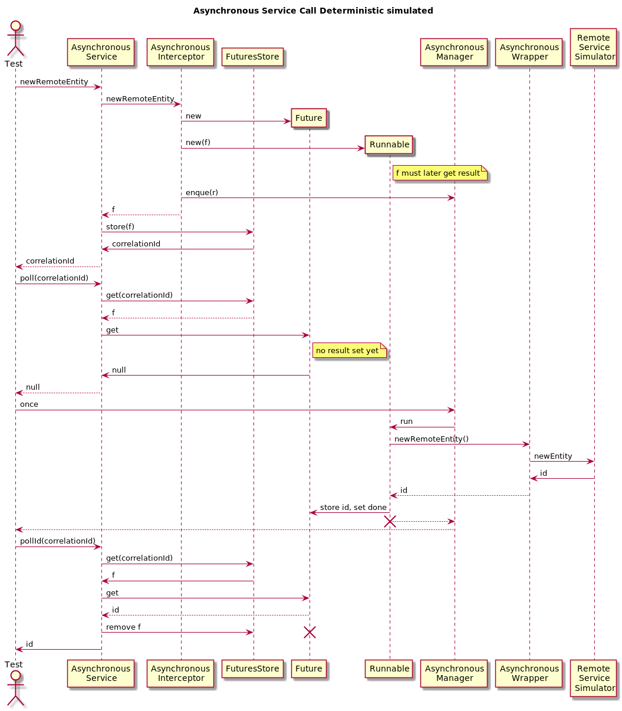

# One Service and One Asynchronously Consumed Service

The service-interface of the previous tests has been changed, so that the answer of the remote service will not be awaited. Instead of returning the actual result, a CorrelationId is returned which later can be used to query for the result itself. For this query 2 function pollId and pushString have been added. They return null, if the result is not ready yet.
The Servercode achieves the asynchronous behaviour by using the @Asynchronous annotation. Each request to the consumed service is forwarded to a bean that delegates these calls to the remote interface inside asynchronous methods. These Methods return "Future"-object which can be used to check, whether the call has been completed, and when, which return the result.

The EjbExtensions which are initiated by EjbUnitRunner intercept these calls by AsynchronousInterceptor which generates a special future. There are two modes of operation possible. Either the future methods: "isDone" and "get" lead to synchronous calls, or the future checks if a lambda routine created to handle the embedded call is completed. In the second mode the AsynchronousManager-Singleton is responsible to handle the call.

To illustrate this the following Tests are created
* [ServiceTest]()
 	* the poll-Routines can be called without further actions, they query the furtures which internally do direct calls
* [AsynchronousServiceTestDeterministic]()
The AsynchronousInterceptor was brought into a modus that leads to the futures not by themselves handling the routine. The separate thread is simulated by enqueuing the request into the AsynchronousManager which will handle it either when once() or something similar is called or by a special thread (next example). 
	* the poll-Routines will return null as long as the asynchronous handling is not initiated yet. Using AsynchronousManager#once works through all current queued activities and handle these synchronously. In this way the test itself can decide in a deterministic way, when the handling is to be done.
  
* [AsynchronousServiceTestMultithreaded]()
	* AsynchronousInterceptor works in non-implicit mode. Additionally using AsynchronousManager#startThread a thread is started that handles the queued routines in background. To make this test deterministic all poll-queries must loop until they return null.
