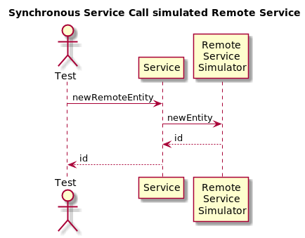

# One Service and One Synchronously Consumed Service

Several possibilities to inject remote services and to simulate those remote services by the Tests are shown.
There are not many calculations done, the servicecall here is for demonstration purposes just propagated to the remote site.

* [Service1]() to be tested hypothetically gets the remote callable interface injected via @EJB.
      @EJB(mappedName = "RemoteServiceIntf/remote")
      RemoteServiceIntf remoteService;
might be code that allows to inject the reference to a remote bean. The following Tests use ejb-cdi-unit to test this configuration in 2 of many possible ways:

    * [ServiceTest]() simulates the remote Service by implementing the interface using a specific class. This is configured into the container inside the @AdditionalClasses Annotation.
    * [ServiceTestWithMockito]() does not use an implementation of the remote interface, but mockito-expressions to generate the required behaviour.  

* [Service2]() alternatively uses a Resources-Bean which handles the lookups of the remote bean. The Test [ServiceTestWithAlternative]() is used to demonstrate the usage of @ActivatedAlternatives.

