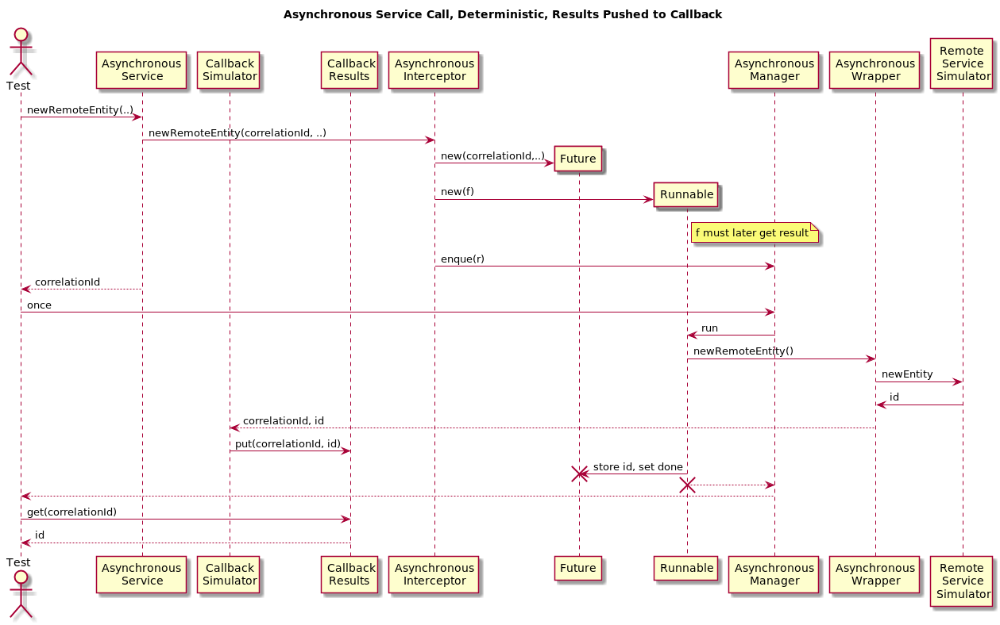

# One Service and One Asynchronously Consumed Service Plus Asynchronous Callback

The previous example gets extended in a way so that the original service consumes a special interface its client provides and calls back as soon as the answer is ready.

